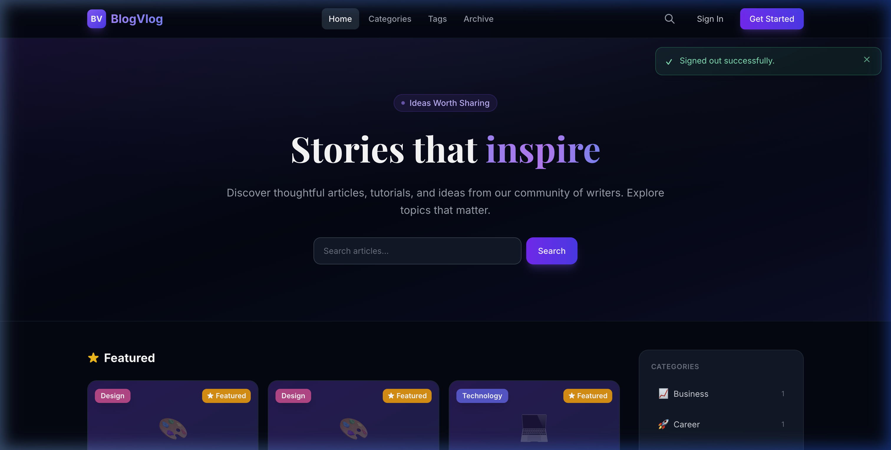
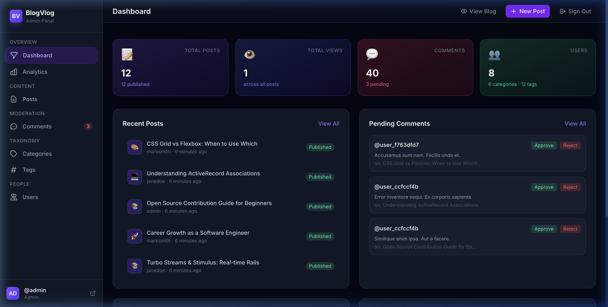

<div align="center">


<br /><br />

<h1>
  
  &nbsp; BlogVlog
</h1>

<p align="center">
  <strong>A production-quality, full-featured blogging platform built with Ruby on Rails 8.1</strong><br />
  Rich text editing · Admin dashboard · Analytics · Threaded comments · Role-based access
</p>

<br />

</div>

---

## ✨ Overview

**BlogVlog** is a modern, feature-rich blog platform engineered to Rails best-practices standards. It ships with a premium dark-mode UI, a full admin content management system, ActionText-powered rich text, Active Storage image handling, and a robust authentication and authorisation layer — ready to deploy to production.

> Built as a showcase of clean Rails architecture: proper separation of concerns, Pundit policies, FriendlyId SEO slugs, counter caches, enum state machines, and a fully custom Hotwire frontend.

---

## 📸 Screenshots

<table>
  <tr>
    <td align="center">
      <strong>Public Homepage</strong><br />
      Hero · Featured posts · Category sidebar
    </td>
    <td align="center">
      <strong>Admin Dashboard</strong><br />
      Stats · Pending moderation · Quick actions
    </td>
  </tr>
  <tr>
    <td></td>
    <td></td>
  </tr>
</table>

---

## 🚀 Feature Highlights

### 📝 Content Management
- **ActionText** rich-text editor (Trix) for writing posts with headings, code blocks, quotes, images, and tables
- **Active Storage** for featured image uploads with automatic resizing (WebP variants)
- **Post workflow** — Draft → Published → Archived
- **Featured posts** flag with dedicated homepage section
- **Automatic reading time** calculated from word count
- **Auto-generated excerpt** from plain-text content
- **Prev / Next / Related posts** navigation
- **Tag list** via comma-separated input with auto-create

### 🗂️ Organisation
- **Categories** with emoji icons, hex colours, and post counter caches
- **Tags** with custom colour assignments and a curated preset palette
- **FriendlyId** URL slugs on Posts, Categories, and Tags (`/posts/my-great-article`)
- **Archive** page — all posts grouped chronologically by year

### 🔍 Discovery
- **Full-text search** across title, excerpt, and body (PostgreSQL ILIKE)
- **Paginated** lists throughout (Kaminari)
- **Category** and **Tag** browsing pages

### 💬 Comments
- **Threaded replies** via self-referential parent/child association
- **Status workflow** — Pending → Approved / Rejected / Spam
- Authors can delete their own comments; admins can delete any

### 🔐 Authentication & Authorisation
- **Devise** — sign-up, sign-in, remember-me, password recovery, email confirmation
- **Three roles** — `reader`, `author`, `admin`
- **Pundit** policies enforced across every controller action
- Custom-styled Devise views matching the dark theme

### 🛡️ Admin Panel (`/admin`)

| Section | Features |
|---------|----------|
| **Dashboard** | Real-time stats, recent posts, pending comments with inline approve/reject |
| **Analytics** | Top posts by views, categories chart, popular tags, author leaderboard |
| **Posts** | Search + status filter, publish/archive/feature actions, full CRUD |
| **Comments** | Filter by status, approve / reject / spam / delete per row |
| **Categories** | Grid view with colour picker and emoji icon selector |
| **Tags** | Cloud view with colour presets and CRUD |
| **Users** | Role filter, inline role-change buttons |

### 🎨 Frontend
- **Tailwind CSS v4** with a full custom `@theme` design system
- **Inter** + **Playfair Display** Google Fonts
- Full **prose** dark-mode styles for ActionText content
- **Trix editor** custom dark-mode skin
- **Stimulus** controllers: dropdown, mobile nav, flash auto-dismiss, reply toggle
- Smooth micro-animations and hover effects throughout
- Fully responsive — mobile-first

### 🔎 SEO
- `meta-tags` gem — per-page title, description, Open Graph support
- FriendlyId slugs on all public URLs
- Semantic HTML5 structure with proper heading hierarchy

---

## 🏗️ Tech Stack

| Layer | Technology |
|-------|------------|
| Framework | Ruby on Rails 8.1.2 |
| Language | Ruby 3.x |
| Database | PostgreSQL 16 |
| ORM | ActiveRecord (with counter caches, enums) |
| Auth | Devise |
| Authorisation | Pundit |
| Rich Text | ActionText + Trix |
| File Storage | Active Storage (local / S3-ready) |
| Frontend | Tailwind CSS v4, Hotwire (Turbo + Stimulus), Importmap |
| Fonts | Inter, Playfair Display (Google Fonts) |
| Pagination | Kaminari + Pagy |
| Slugs | FriendlyId |
| SEO | meta-tags |
| Testing Data | Faker |
| Web Server | Puma |
| Asset Pipeline | Propshaft |

---

## 📁 Project Structure

```
blog-vlog/
├── app/
│   ├── controllers/
│   │   ├── admin/               # Admin namespace (base, dashboard, posts, comments…)
│   │   ├── posts_controller.rb
│   │   ├── comments_controller.rb
│   │   ├── categories_controller.rb
│   │   ├── tags_controller.rb
│   │   ├── search_controller.rb
│   │   └── users_controller.rb
│   ├── models/
│   │   ├── user.rb              # Devise + roles + avatar
│   │   ├── post.rb              # ActionText, FriendlyId, status enum, reading time
│   │   ├── category.rb          # FriendlyId, icon, colour
│   │   ├── tag.rb               # FriendlyId, colour presets
│   │   └── comment.rb           # Threaded, status enum
│   ├── policies/                # Pundit authorisation policies
│   ├── views/
│   │   ├── admin/               # Full admin UI
│   │   ├── posts/               # Homepage, show, archive, card partial
│   │   ├── categories/ tags/ comments/ users/ search/
│   │   ├── devise/              # Custom-styled auth pages
│   │   ├── layouts/             # Public + admin layouts
│   │   └── shared/              # Pagination, flash, sidebar, form errors
│   ├── javascript/
│   │   └── controllers/         # Stimulus: dropdown, navbar, flash, reply-toggle
│   ├── helpers/
│   │   └── application_helper.rb
│   └── assets/
│       └── tailwind/
│           └── application.css  # Tailwind v4 + ActionText prose styles
├── config/
│   ├── routes.rb                # RESTful routes + admin namespace
│   └── environments/
├── db/
│   ├── migrate/                 # All migrations with proper indexes
│   ├── schema.rb
│   └── seeds.rb                 # Rich sample data
└── Gemfile
```

---

## ⚡ Getting Started

### Prerequisites

- Ruby `3.2+`
- PostgreSQL `14+`
- Node.js (for Importmap / Tailwind build)
- Bundler `2.x`

### 1 · Clone & install

```bash
git clone git@github.com:zumair12/blog-vlog.git
cd blog-vlog
bundle install
```

### 2 · Configure the database

```bash
cp config/database.yml.example config/database.yml
# Edit with your PostgreSQL credentials
```

### 3 · Set up the database

```bash
rails db:create db:migrate db:seed
```

### 4 · Start the development server

```bash
bin/dev
```

Open **http://localhost:3000** 🎉

---

## 🔑 Default Credentials (after seeding)

| Role | Email | Password |
|------|-------|----------|
| **Admin** | `admin@blogvlog.com` | `password123` |
| **Author** | `jane@blogvlog.com` | `password123` |
| **Author** | `mark@blogvlog.com` | `password123` |

Admin panel: **http://localhost:3000/admin**

---

## 🗄️ Database Schema

```
users          – id, email, encrypted_password, username, role, bio, website, twitter_handle, posts_count, …
posts          – id, title, slug, excerpt, status, featured, views_count, reading_time, published_at, user_id, category_id, …
categories     – id, name, slug, description, icon, color, posts_count
tags           – id, name, slug, color, posts_count
post_tags      – post_id, tag_id  (join table)
comments       – id, body, status, parent_id, user_id, post_id, …
action_text_rich_texts   – ActionText content storage
active_storage_blobs     – Active Storage file metadata
active_storage_attachments
```

---

## 🔒 Roles & Permissions

| Action | Reader | Author | Admin |
|--------|:------:|:------:|:-----:|
| Read posts & comments | ✅ | ✅ | ✅ |
| Write comments | ✅ | ✅ | ✅ |
| Create / edit own posts | ❌ | ✅ | ✅ |
| Publish / archive posts | ❌ | ✅ | ✅ |
| Manage all posts | ❌ | ❌ | ✅ |
| Moderate comments | ❌ | ❌ | ✅ |
| Manage categories & tags | ❌ | ❌ | ✅ |
| Manage users & roles | ❌ | ❌ | ✅ |
| View analytics | ❌ | ✅ | ✅ |

---

## 🌐 Key Routes

```
GET  /                        → Homepage (featured + latest posts)
GET  /posts/:slug             → Post detail
GET  /categories              → Browse categories
GET  /categories/:slug        → Posts by category
GET  /tags                    → Tag cloud
GET  /tags/:slug              → Posts by tag
GET  /archive                 → All posts by year
GET  /search                  → Full-text search
GET  /@:username              → Public author profile

GET  /admin                   → Admin dashboard
GET  /admin/analytics         → Analytics page
GET  /admin/posts             → Posts management
GET  /admin/comments          → Comment moderation
GET  /admin/categories        → Categories CRUD
GET  /admin/tags              → Tags CRUD
GET  /admin/users             → Users management

GET  /auth/sign_in            → Login
GET  /auth/sign_up            → Register
```

---

## 🧪 Seed Data

`rails db:seed` creates:

- **8 users** (1 admin, 2 authors, 5 readers)
- **6 categories** — Technology, Design, Business, Tutorial, Opinion, Career
- **12 tags** — ruby, rails, javascript, typescript, react, css, and more
- **12 published posts** with rich content, categories, and tag assignments
- **40 comments** — threaded replies, mix of approved and pending

---

## 📦 Deployment

The app is production-ready. For deployment:

1. Set environment variables: `DATABASE_URL`, `SECRET_KEY_BASE`, `RAILS_MASTER_KEY`
2. Configure Active Storage for cloud (S3/GCS) in `config/storage.yml`
3. Set up a mailer (SMTP / SendGrid) in `config/environments/production.rb`
4. Run `rails assets:precompile` before deploying
5. Works out-of-the-box with **Heroku**, **Render**, **Fly.io**, or **Kamal**

---

## 🤝 Contributing

Pull requests are welcome. For major changes, please open an issue first to discuss what you'd like to change.

1. Fork the project
2. Create your feature branch (`git checkout -b feature/amazing-feature`)
3. Commit your changes (`git commit -m 'feat: add amazing feature'`)
4. Push to the branch (`git push origin feature/amazing-feature`)
5. Open a Pull Request

---

## 📄 License

This project is licensed under the **MIT License** — see the [LICENSE](LICENSE) file for details.

---

<div align="center">

Made with ❤️ and Ruby on Rails

**[⭐ Star this repo](https://github.com/zumair12/blog-vlog)** if you found it useful!

</div>
